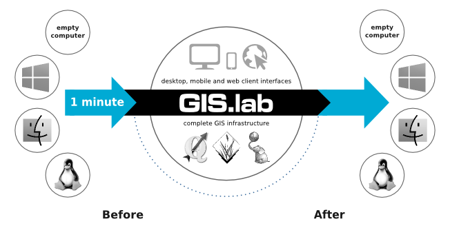

What is GIS.lab?
================

See `GIS.lab official documentation
<http://gislab.readthedocs.io/en/latest/>`_ for details.

GIS.lab is a tool for simple, unbreakable, always **ready and clean
deployment of multiple machines running software mainly for Geographic
Information Systems (GIS)** as well as for office.

   GIS.lab logo.

It is **free technology** which can instantly turn any computer
network into fully equipped geospatial cluster. It is capable to
deploy a complete, centrally managed and horizontally scalable
geospatial infrastructure in local area network, data center or cloud
in a few moments. It is provided as comprehensive set of free
geospatial software seamlessly integrated into one, easy-to-use system
with out-of-box running services capable to run with minimal
maintenance requirements for desktop, web and mobile client
interfaces.

            
   Schema representing what GIS.lab is all about.

Launching GIS.lab Desktop Client
--------------------------------

There are two different ways of launching GIS.lab Desktop. Depending
on future usage, hardware and software possibilities and other similar
factors, GIS.lab Desktop can be implemented using **virtal or physical
mode**.

Virtual mode can be used for any operating system. Original operating
system and GIS.lab will be available. On the other hand, physical mode
represents best performance but original operating system is temporary
lost.

   
   GIS.lab Desktop launched in virtual or physical mode.

GIS.lab cluster
---------------

GIS.lab cluster is managed by decentralized cluster management tool
called Serf based on GOSSIP protocol. Serf is responsible for
automatic joining and removing machines to and from GIS.lab cluster
and OWS load balancer management and can serve as failure detection
system. This automatic cluster orchestration system is also used as
interface for running cluster events and queries.

   GIS.lab cluster architecture.

How to use GIS.lab Desktop Client
---------------------------------

Ordinary GIS.lab client environment is shown below. Desktop layout is
created by main panel, background with GIS.lab logo and in bottom part
one can see also some basic system information.

.. figure:: images/client-layout.png

   Basic GIS.lab client Desktop layout.

Main panel contains:

* applications launcher - list of all available applications, settings
  and log out menu
* quick launcher - home directory browser, launchers of the most
  frequently used applications
* virtual desktops - virtual desktops switcher and overview
* running applications - running applications list and switcher
* keyboard layout - available keyboard layouts switcher
* battery - battery status
* chat - messaging status
* sound - sound control and network status
* time - calendar and time information

Directory layout
~~~~~~~~~~~~~~~~

.. figure:: images/client-layout-dir.png

   Directory layout.

Logout
~~~~~~

User must log out to correctly finish work with GIS.lab client by
using Log out menu available from applications launcher.

.. figure:: images/client-layout-logout.png

   Log out of the GIS.lab Desktop.

Is GIS.lab similar to OSGeo Live?
---------------------------------

GIS.lab is automatic deployment of GIS infrastructure - more or less
opposite to OSGeo Live.

OSGeo-Live is a self-contained bootable DVD, USB thumb drive or
Virtual Machine based on Lubuntu that allows user to try a wide
variety of free and open source geospatial software without installing
anything, it is like a Linux distribution.

GIS.lab is a operative system that uses a server where it is installed
and server clients can attach to it using a LAN. It is easily
configurable and it contains by default some of the most used free and
open source geospatial software.
