.. |addraster| image:: ../_static/icons/grass/layer-raster-add.png
   :width: 1.5em
.. |addvector| image:: ../_static/icons/grass/layer-vector-add.png
   :width: 1.5em
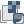

           
GRASS GIS
=========

The first thing to do when starting to work in GRASS is to create a
Location. GRASS Locations are single projection areas with a defined
resolution and extent. The initial location can be easily created from
an existing data set. 

GRASS DataBase Structure
------------------------

The GRASS database structure contains three levels:

#. **DataBase** is a directory on local or network disc which contains
   all data accessed by GRASS. It's usually directory called
   "grassdata" located in user's home directory.

#. **Location** is a subdirectory in DataBase which plays a role of
   project area. All geospatial data stored within one location must
   have the same spatial coordinate system. Location also defines
   default computational region.

#. **Mapset** is a subdirectory in a location. It helps to organize
   maps into logical groups or to separate parallel work of more users
   on the same project (within one location).

When starting GRASS you must to define all these three items, see
figure bellow.

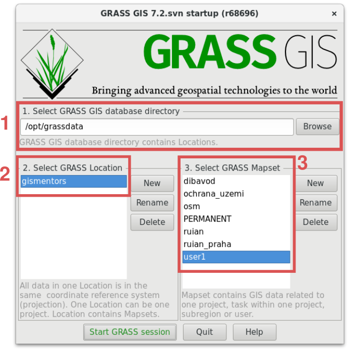

   GRASS startup screen to choose database, location, and mapset.
            
The user have write permission only to the current mapset, maps from
other mapsets within one location can be read without restrictions (if
not defined on OS level), see figure bellow. The list of visible
mapsets can be modified in menu :menuselection:`Settings --> GRASS
working environment --> Mapset access`.

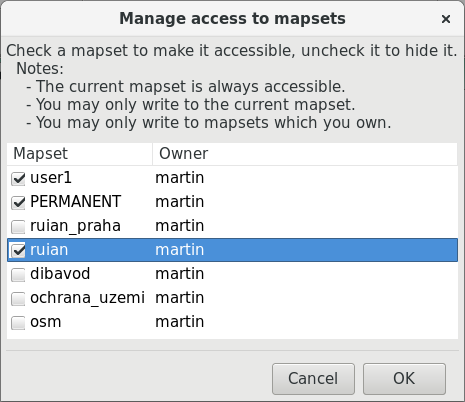
        
   Dialog for modifying mapset search path.
   
Accessing maps from other locations requires to reproject selected map
by :grasscmd:`r.proj` (raster maps) or :grasscmd:`v.proj` (vector
maps). GRASS doesn't support so-called reprojection-on-the-fly.

.. notecmd:: GRASS can be started by specifying full path to the mapset

   .. code-block:: bash

      grass72 /opt/grassdata/gismentors/user1
   
Creating new location
^^^^^^^^^^^^^^^^^^^^^

You can create new location when starting GRASS, or from running
session in the menu :menuselection:`Settings --> GRASS working
environment --> Create new location`.

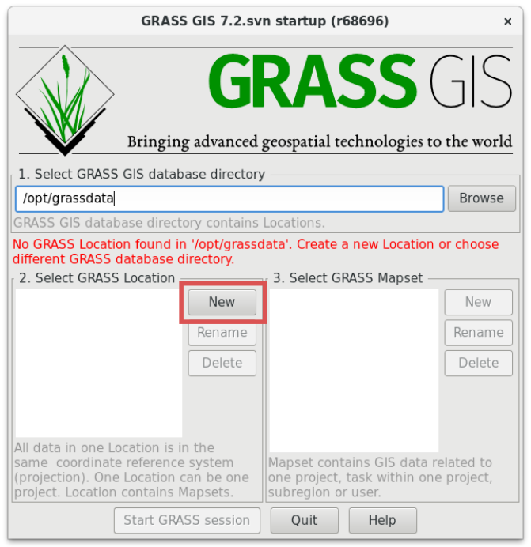

   Create new location from startup screen.

In the location wizard you define name for new location.

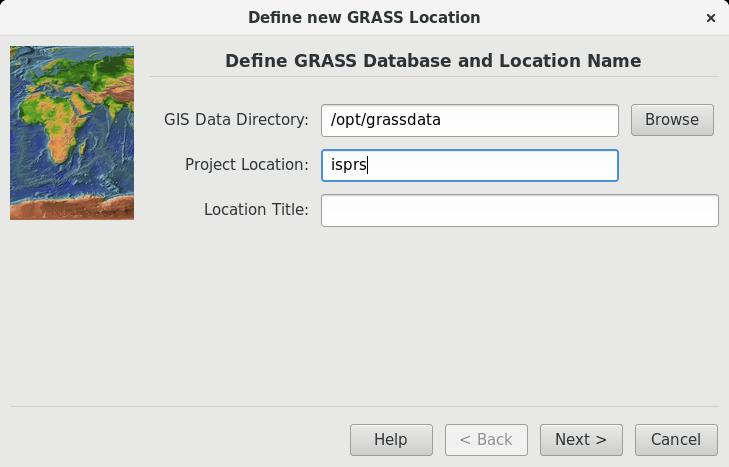

   Name for a new location.

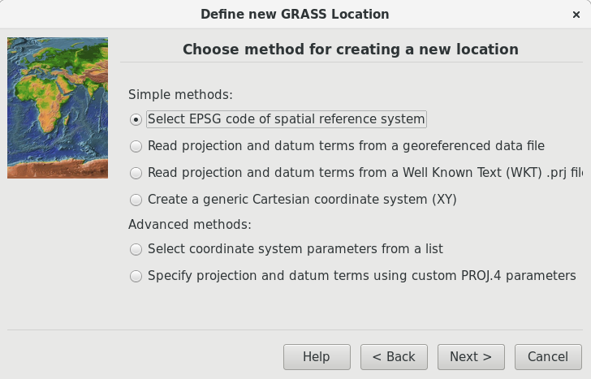

   Methods for creating a new location.

We will choose mostly used method based on well-known EPSG
code, in our case UTM zone 33N - :epsg:`32633`.

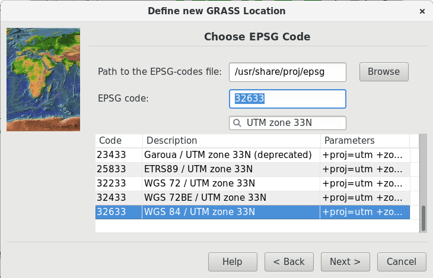

   Creation of new location with EPSG code 32633.

When the new location is created you can choose it from the GRASS
startup screen.

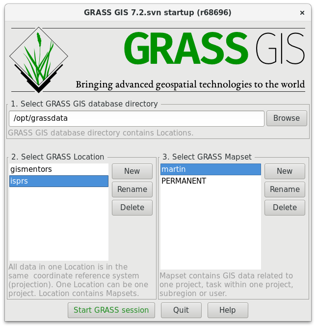

   New location accessible via GRASS startup screen.

.. notecmd:: New GRASS location can be also created

   .. code-block:: bash

      grass72 -c EPSG:32633 ~/grassdata/isprs/PERMANENT

Import vector data
------------------

Dialog for importing vector data is accessible from menu
:menuselection:`File --> Import vector data --> Common import
formats`, from the main toolbar, or from command line using
:grasscmd:`v.import` module.

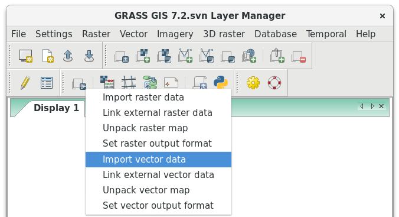

   Import vector data from the main toolbar.

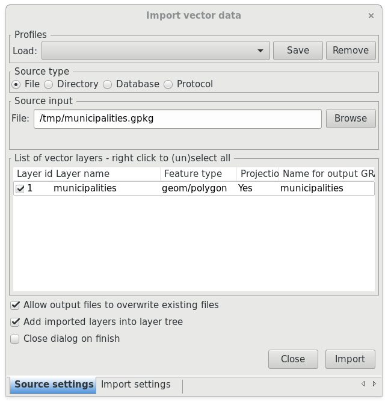

   Example of importing vector layer from OGC GeoPackage file.

.. noteadvanced:: Import process can take a while. GRASS is a topological
          GIS. It means that importing vector data doesn't mean only
          converting data from one data format to another, but mainly
          converting from simple feature model to GRASS topological
          model, see figure bellow.

          .. figure:: images/grass7-topo.png
             :class: middle
                  
             GRASS topological model.
          
          During this process also topological errors are
          checked and repaired. Some topological errors is not
          possible to repair automatically without user specification,
          in this case the user can fix remaining error using
          :grasscmd:`v.clean`.
             
Import raster data
------------------

Raster data is possible to import from the menu :menuselection:`File
--> Import raster data --> Common import formats`, from the main
toolbar, or from command line using :grasscmd:`r.import` module.

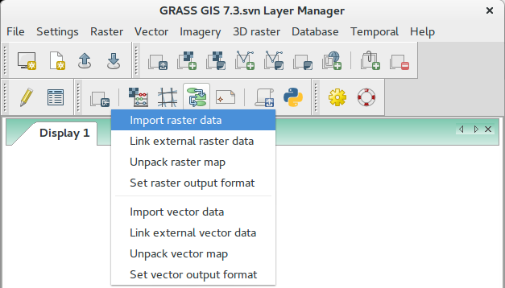

   Import raster data from the main toolbar.

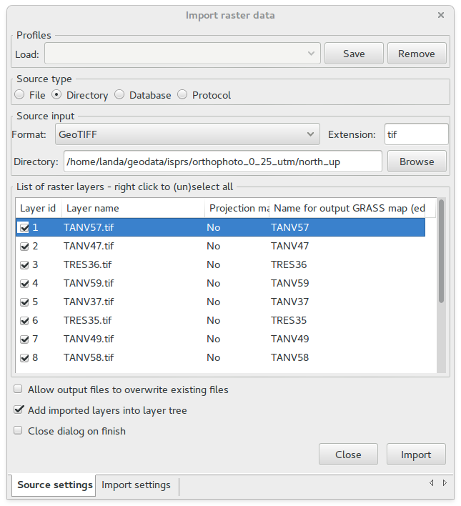

   Example of importing raster files in GeoTIFF format from
   directory. Since raster files lack spatial reference information
   (project doesn't match) we will force overriding project check
   (:menuselection:`Import settings --> Optional --> Override
   projection check`).

.. noteadvanced:: To avoid data duplication GRASS also allows linking
                  raster data using :grasscmd:`r.external` (*Link
                  external raster data*).

.. note:: GRASS imports raster bands as separate raster maps. Raster
          maps are represented by regular grid. Three different types
          are supported:

          * CELL (integer)
          * FCELL (float)
          * DCELL (double)
               
Working with GUI
----------------

GRASS GUI consists of two main windows:

* Layer Manager :fignote:`(1.)`
* Map Display (user can run multiple Map Display windows) :fignote:`(2.)`

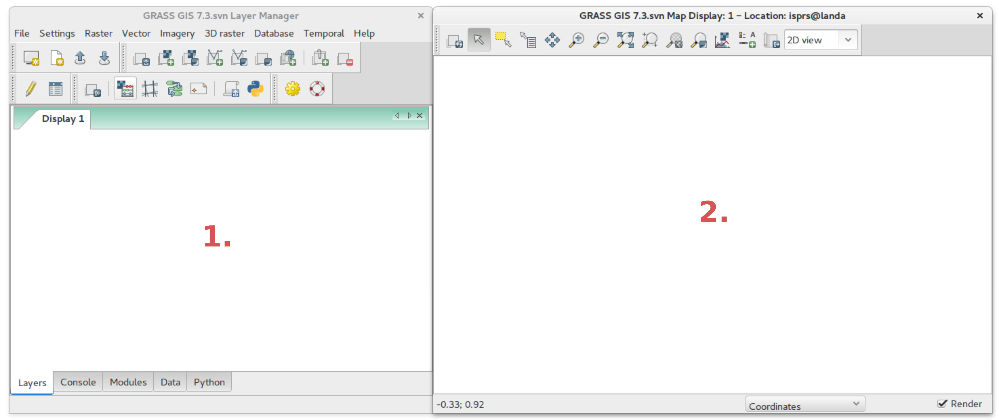
        
   Layer Manager and Map Display GUI components.

Vector maps can be added similarly to rasters from :menuselection:`File
--> Map display --> Add vector`, or from the Layer Manager toolbar
|addvector|.

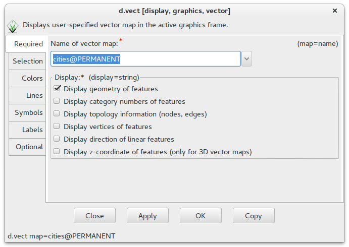

   Dialog (:grasscmd:`d.vect`) for displaying vector data in the Map
   Display.

Raster maps can be added to layer tree from menu :menuselection:`File
--> Map display --> Add raster`, or from the Layer Manager toolbar
|addraster|.

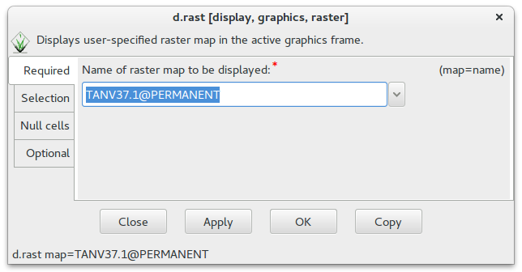

   Dialog (:grasscmd:`d.rast`) for displaying raster data in the Map
   Display.

RGB orthophotos has been spitted by GRASS into three separate raster
maps:

* red channel (``.1``)
* green channel (``.2``)
* blue channel (``.3``)

You can also add multiple raster or vector maps from Layer Manager
toolbar by |addmulti|.

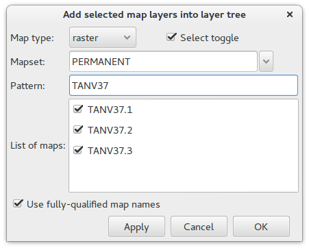
        
   Add multiple raster maps to layer tree.
  
RGB composition can be added from Layer Manager toolbar by |addrgb|.

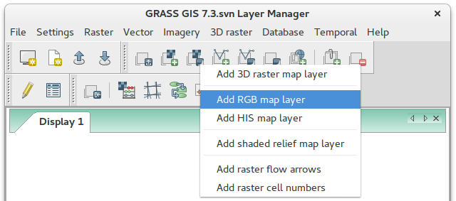

   Add RGB layer.

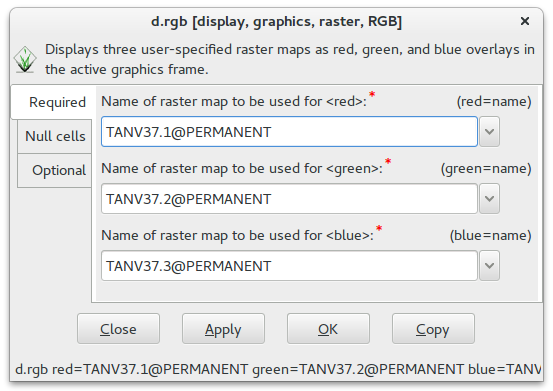

   Compose raster maps to RGB.

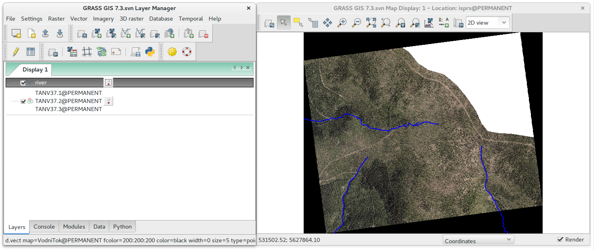
        
   Example of data visualization.

Accessing GRASS Modules
-----------------------

GRASS is modular system which consists of several hundreds tools
(called "modules"). They are accessible from the Layer Manager menu,
"Modules" tab, and from command prompt ("Console" tab).

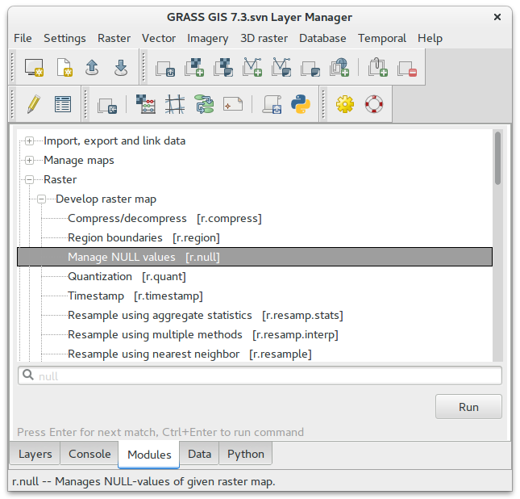

   Searching module in Layer Manager.

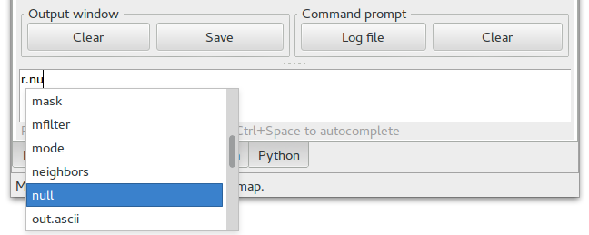

   Launching module from Layer Manager console.

The commands (modules) can be called from GUI dialogs and from command
line. Figure bellow shows GUI dialog of :grasscmd:`r.null` module. The
equivalent command for console would be:

.. code-block:: bash

   r.null map=TANV37.1 setnull=0,255

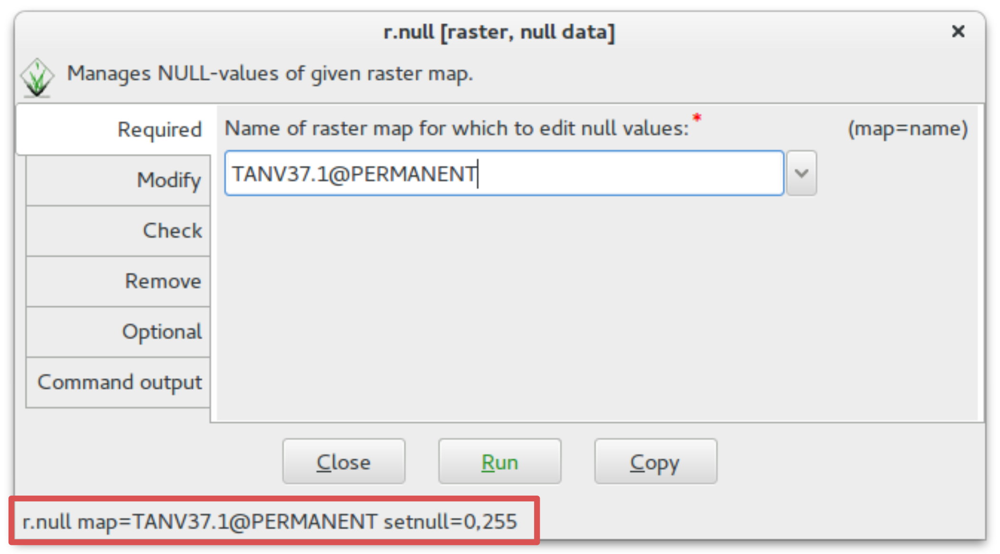

   Dialog of :grasscmd:`r.null` module.

.. note:: This command replaces in raster maps occurrence of 0 a 255
          values by NULL value (no-data). Note that before running
          this command you need to set up **computational region** based
          on selected raster map (:grasscmd:`g.region`).

          .. figure:: images/set-region-rgb.png

             Set computational region from RGB composition.

          Also note that all three raster maps in composition should
          be modified by :grasscmd:`r.null`. This operation can be
          automated by :grasscmd:`Graphical Modeler <g.gui.gmodeler>`
          or by scripting in Python, see :doc:`Lesson 3
          <../lesson3/index>` for details.

          Performing NULL propagation can introduce holes into
          image. One of solutions would be to create RGB composition
          using :grasscmd:`r.composite` and fill holes with
          combination of :grasscmd:`r.neighbors` (method=mode) and
          :grasscmd:`r.mapcalc`, example bellow.

          .. code-block:: bash

             r.composite red=TANV37.1 green=TANV37.2 blue=TANV37.3 output=TANV37
             r.neighbors input=TANV37 output=TANV37_mode method=mode
             r.mapcalc expression="TANV37_final = if ( isnull( TANV37.1 + TANV37.2 + TANV37.3 ), TANV37_mode, TANV37 )"
             r.colors map=TANV37_final raster=TANV37

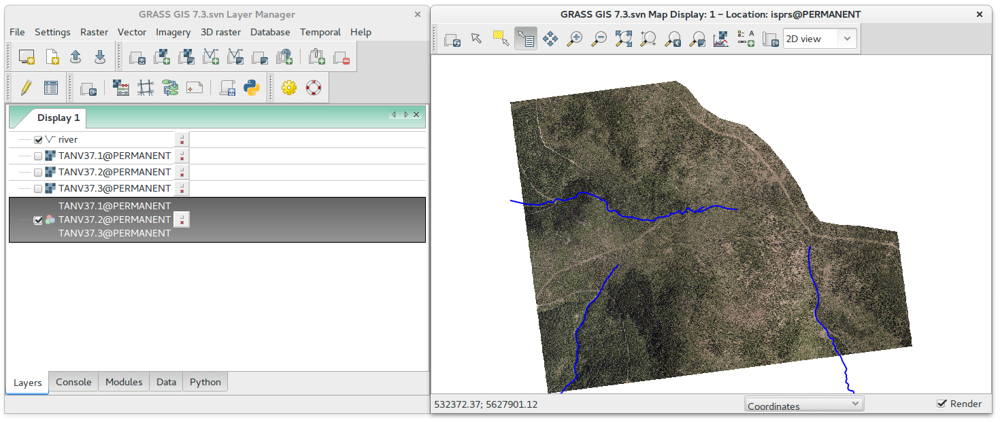
        
   Result of replacing 0 a 255 values by no-data value.

Working with vector attributes
^^^^^^^^^^^^^^^^^^^^^^^^^^^^^^

Tool for browsing and modifying attribute data of vector features is
accessible from the layer contextual menu *Attribute data* or from the
Layer Manager toolbar |dbmgr|.

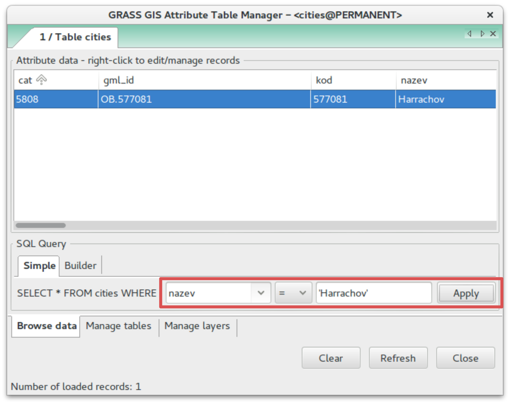

   Example of selecting city Harrachov.

.. note:: One of GRASS mottos is "Everything what is possible to
          perform using GUI is possible to reproduce in command
          line". For example the operation presented above can be
          reproduced by :grasscmd:`v.extract` command.

          .. code-block:: bash

             v.extract input=cities where="nazev = 'Harrachov'" output=harrachov
                
QGIS Plugin
-----------

GRASS plugin enables QGIS to access raster and vector data in GRASS
format, to display them, browse, and modify including topological
editing. The plugin also allows launching GRASS tools (modules)
directly from QGIS user interface.

.. note:: We highly recommend QGIS version 2.14 or higher (this
          version of QGIS is the first which comes with GRASS 7
          included).

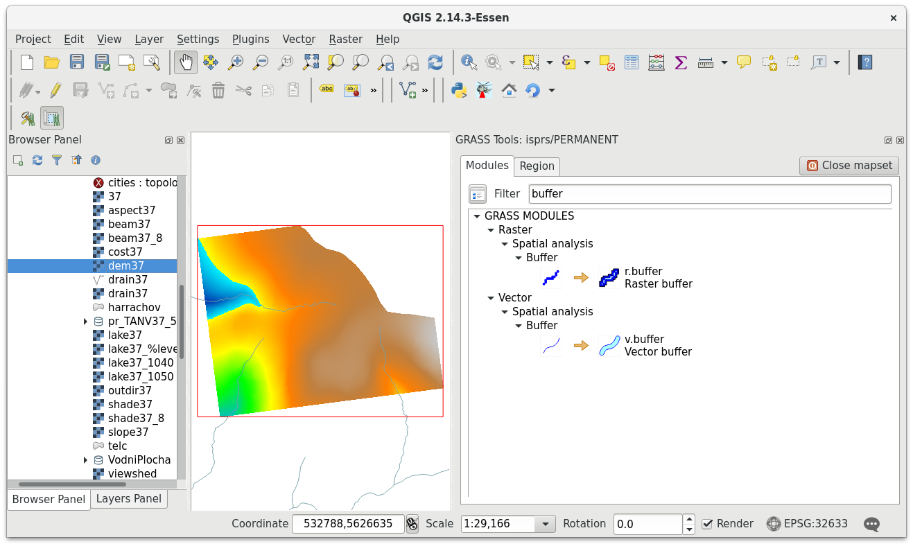
   
   QGIS GRASS plugin in action.
