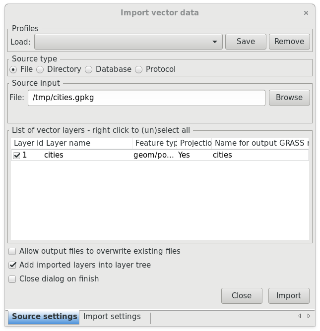

GRASS GIS
=========

The first thing to do when starting to work in GRASS is to create a
Location. GRASS Locations are single projection areas with a defined
resolution and extent. The initial location can be easily created from
an existing data set. 

GRASS DataBase Structure
------------------------

The GRASS database structure contains three levels:

#. **DataBase** which a directory on local or network disc which contais
   all data accessed by GRASS. It's usually directory called
   "grassdata" located in user's home directory.

#. **Location** is a subdirectory in DataBase which plays a role of
   project area. All geospatial data stored within one location must
   have the same spatial coordinate system. Location also defines
   default computational region.

#. **Mapset** is a subdirectory in a location. It helps to organize maps
   into logical groups or helps to separate pararel work of more users
   on the same project (within one location).

When you start GRASS you must to defined all these three items, see
figure bellow.

   GRASS statup screen to choose database, location, and mapset.
            
The user have write access only to the current mapset, but she/he can
access also maps from other mapset within one location, see figure
bellow. The list of visible mapsets can be modified in menu
:menuselection:`Settings --> GRASS working environment --> Mapset
access`.

.. figure:: images/mapset-access.png
   :class: small
        
   Dialog for modifying mapset search path.
   
The access to maps from other locations requires to reproject a
selected map by :grasscmd:`r.proj` (raster maps) or :grasscmd:`v.proj`
(vector maps). GRASS doesn't support so-called
reprojection-on-the-fly.

.. notecmd:: GRASS can be started also from command line specifing
             full path to the mapset.

   .. code-block:: bash

      grass72 /opt/grassdata/gismentors/user1
   
Creating new location
^^^^^^^^^^^^^^^^^^^^^

You can create new location when starting GRASS or from running
session in the menu :menuselection:`Settings --> GRASS working
environment --> Create new location`.

   Create new location from startup screen.

In the location wizard you define name for new location.

.. figure:: images/new-location-1.png

   Name for a new location.

.. figure:: images/new-location-2.png

   Methods for creating a new location.

We will choose mostly used method based on well-known EPSG
code, in our case UTM zone 33N - :epsg:`32633`.

.. figure:: images/new-location-3.png

   Creation of new location with EPSG code 32633.

When the new location is created you can choose it from the GRASS
startup screen.

.. figure:: images/new-location-4.png

   New location accessible via GRASS startup screen.

Import vector data
------------------

Dialog for importing vector data is accessible from menu
:menuselection:`File --> Import vector data --> Common import formats`
or from the main toolbar.

   Import vector data from the main toolbar.

   Example of importing vector layer from OGC GeoPackage file.
   
Import raster data and compose RGB
----------------------------------

Raster data is possible to import from the menu :menuselection:`File
--> Import raster data --> Common import formats` or from the main
toolbar.

.. todo:: ortofoto + d.rgb
   
   
Working with GUI
----------------

.. todo:: doplnit
   
Accessing GRASS Modules
-----------------------

.. todo:: v.extract

.. code-block:: bash

   v.extract input=cities where="nazev = 'Harrachov'" output=harrachov
   v.extract input=cities where="nazev = 'Telč'" output=telc

                
QGIS Plugin
-----------

.. todo:: ?
