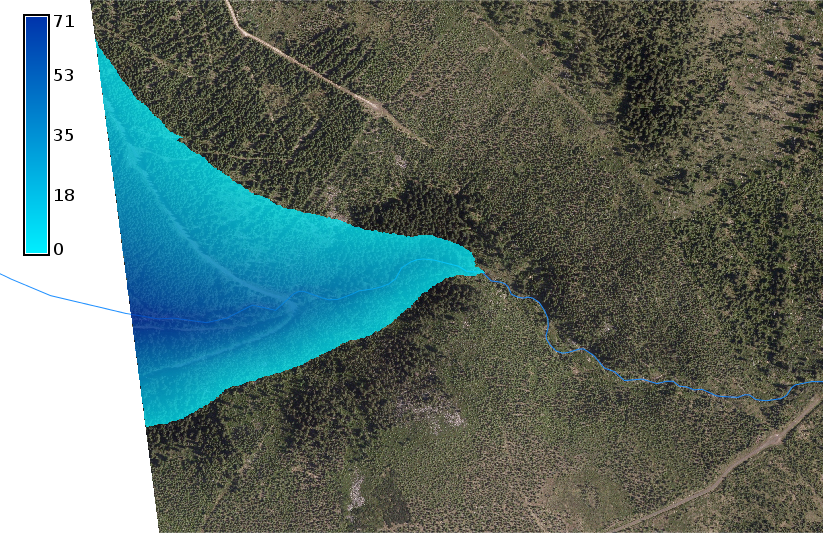
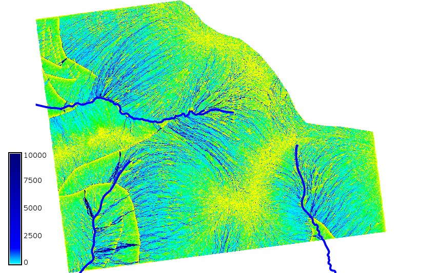
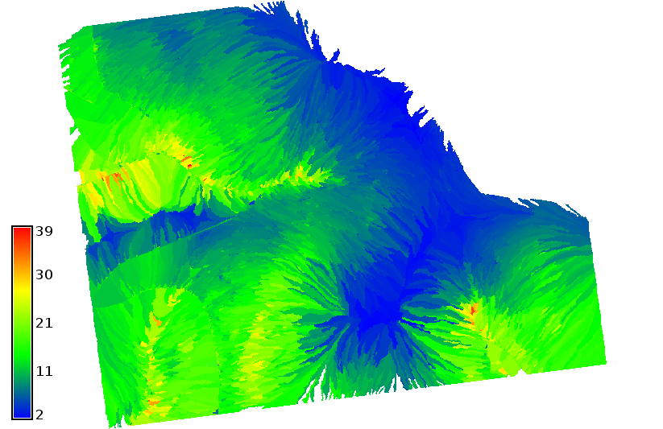
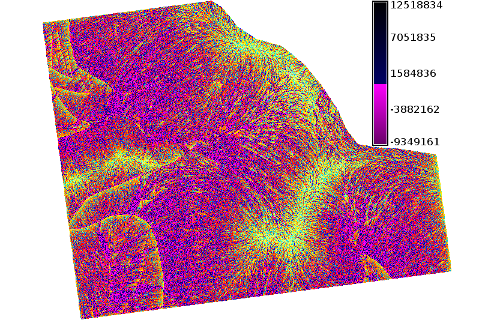

Hydrology
=========

Flooding Simulation
-------------------

Flooding can be easily simulated by :grasscmd:`r.lake` module which
fills a lake to a target water level from a given start point or seed
raster. The resulting raster map contains cells with values
representing lake depth (NULL for all other cells beyond the lake).

Example:

.. code-block:: bash
                
   r.lake elevation=dem37 lake=lake37 coordinates=532334,5626968 water_level=1040

   Flooding visualization.
      
.. note:: See also related *r.lake.series* addon, details in
          :doc:`lesson 4 <../lesson4/index>`.
          
Flow accumulation and watersheds
--------------------------------

Watersheds and flow accumulation can be derived by
:grasscmd:`r.watershed`.

.. code-block:: bash

   r.watershed -a elevation=dem37 accumulation=faccum37 basin=watersheds37 threshold=1000
   

   Flow accumulation map with legend.

For compute average slope value for each watershed can be used zonal
statistics using :grasscmd:`r.stats.zonal`:

.. code-block:: bash

   r.watershed elevation=dem37 accumulation=faccum37 basin=watersheds37 threshold=1000
   r.stats.zonal base=watersheds37 cover=slope37 method=average output=watersheds_slope37
   r.colors map=watersheds_slope37 color=bgyr

   Average slope value of each watershed.

.. todo:: Exaplain -a flag

Erosion modeling
----------------   

Landscape potential for soil erosion and deposition can be estimated
and mapped using Unit Stream Power Based Erosion Deposition model
(`USPED
<https://www.slu.se/en/Collaborative-Centres-and-Projects/slu-water-hub/models/usped/>`_). In
this example we will use uniform land cover (C factor) and soil
erodibility (K factor). Install addon *r.divergence* using
:grasscmd:`g.extension`.

.. code-block:: bash

   r.watershed -a elevation=dem37 accumulation=faccum37 basin=watersheds37 threshold=1000
   # topographic sediment transport factor (resolution=1.0)
   r.mapcalc expression="sflowtopo37 = pow(faccum37 * 1.0,1.3) * pow(sin(slope37), 1.2)"
   # compute sediment flow by combining the rainfall, soil and land
   # cover factors with the topographic sediment transport factor.
   # we use a constant value of 270 for rainfall intensity factor
   # k_factor = 0.1 ; c_factor=0.05
   r.mapcalc expression="sedflow37 = 270. * 0.1 * 0.05 * sflowtopo37"
   # compute divergence of sediment flow
   r.divergence magnitude=sedflow37 direction=aspect37 output=erosion_deposition37

At end we can set custom color table using :grasscmd:`r.colors`:

::   

    0% 100:0:100
    -100 magenta
    -10 red
    -1 orange
    -0.1 yellow
    0 200:255:200
    0.1 cyan
    1 aqua
    10 blue
    100 0:0:100
    100% black

   Landscape potential for soil erosion and deposition.
