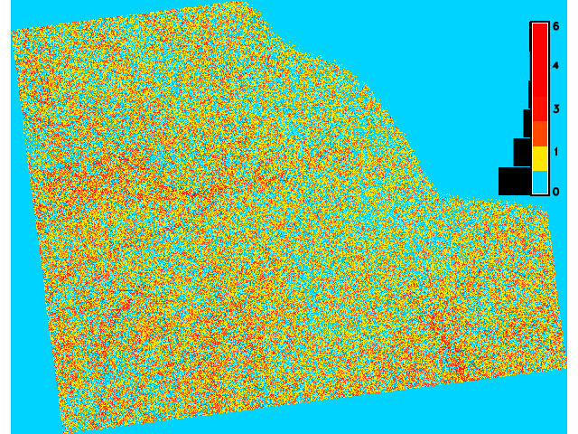

Data Import and Export
======================

Import vector data
------------------

.. todo:: Shapefile (GUI, CLI)
          
Import raster data and compose
------------------------------

.. todo:: Orthophoto 
   
Import Lidar data
-----------------

XYZ format
^^^^^^^^^^

.. todo:: r.in.xyz
          
LAS format
^^^^^^^^^^

First check LAS data format using ``lasinfo`` tool (part of `libLAS
<http://www.liblas.org>`_ library), especially the extent:

.. code-block:: bash

   lasinfo pr_TANV37_5g.laz

   ...
   Min X Y Z:                   531815.05 5625597.55 925.35
   Max X Y Z:                   534548.84 5627727.26 1292.54
   Spatial Reference:           None

The extent in GRASS syntax can be also obtained by
:grasscmd:`r.in.lidar` GRASS command using :option:`-sg` flags:

.. code-block:: bash
                          
   r.in.lidar -sgo input=pr_TANV37_5g.laz

.. note:: Flag :option:`-o` is used since the input file miss the
          spatial reference information.

The compulational region can be set afterward by :grasscmd:`g.region`
command:

.. code-block:: bash

   g.region n=5627727.260000 s=5625597.550000 e=534548.840000 w=531815.050000 b=925.350000 t=1292.540000 -p

Points density
~~~~~~~~~~~~~~

First we set spatial resolution to 1 meter:

.. code-block:: bash

                g.region res=1 -pa

.. note:: Flag :option:`-a` used to align region to resolution.

and compute the density for all points:

.. code-block:: bash
                
   r.in.lidar -o input=pr_TANV37_5g.laz output=pr_TANV37_5g method=n

We can also define color table (in our case blue-cyan-yellow-red) for
imported data by :grasscmd:`r.colors` including histogram
equalization:

.. code-block:: bash

   r.colors -e map=pr_TANV37_5g color=bcyr
                          
.. tip:: 

   Data can be easily rendered by GRASS display commands like
   :grasscmd:`d.rast`, :grasscmd:`d.legend`, or :grasscmd:`d.vect` and
   others. GRASS graphical monitors are both interactive (GUI) and
   non-interactive (file-based). To render data by GRASS a graphical
   monitor must be started and at end to be closed. Both operation can
   be done by :grasscmd:`d.mon` command. In the example is
   demonstrated how the figure bellow was created.

   .. code-block:: bash

      d.mon start=cairo output=pr_TANV37_5g.png
      d.rast pr_TANV37_5g
      d.legend -fsd raster=pr_TANV37_5g at=55,95,92,95
      d.mon stop=cairo

      Density for all points vizualization.
