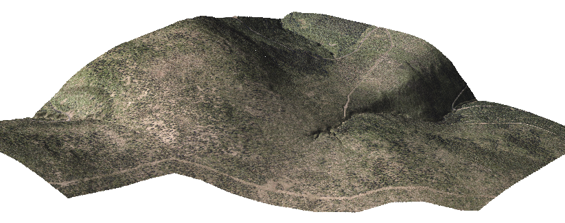

Working with Lidar data
=======================

Import data
-----------

LAS format
^^^^^^^^^^

For importing LAS data are available two modules:

* :grasscmd:`r.in.lidar` which create a new raster map
* :grasscmd:`v.in.lidar` which create a new vector point map

.. note:: GRASS must be compiled with support for `libLAS
          <http://www.liblas.org>`_ library.

Example:

.. code-block:: bash

   r.in.lidar -oe input=pr_TANV37_5g.laz output=pr_TANV37_5g resolution=1
   v.in.lidar -ot input=pr_TANV37_5g.laz output=pr_TANV37_5g

.. note:: Flag :option:`-o` must be used in the case since input data
          miss information about spatial reference system. Basic
          metadata about imported data can be obtained by ``lasinfo``
          command which is part of libLAS library.

          .. code-block:: bash

             lasinfo pr_TANV37_5g.laz

             ...
             Min X Y Z:                   531815.05 5625597.55 925.35
             Max X Y Z:                   534548.84 5627727.26 1292.54
             Spatial Reference:           None

          Flag :option:`-t` skips creation of attribute table. The
          import process will be significantly faster.

          In the case of :grasscmd:`r.in.lidar` is also used flag
          :option:`-e` which extends current computational region to
          cover all imported points. Otherwise user needs to set up
          computational region via :grasscmd:`g.region` as in the case
          of :grasscmd:`r.in.xyz`, see section bellow. Spatial
          resolution for output raster map is defined by
          :option:`resolution` option. Note that computational region is
          ignored when importing data using :grasscmd:`v.in.lidar`.

Basic metadata about imported created raster maps
can be optained by :grasscmd:`r.info`, or :grasscmd:`v.info` in the
case of vector maps.

.. code-block:: bash

   r.info map=pr_TANV37_5g

   ...
   |   Data Type:    FCELL                                                      |
   |   Rows:         2131                                                       |
   |   Columns:      2734                                                       |
   |   Total Cells:  5826154                                                    |
   |        Projection: UTM (zone 33)                                           |
   |            N:    5627728    S:    5625597   Res:     1                     |
   |            E:     534549    W:     531815   Res:     1                     |
   |   Range of data:    min = 925.355  max = 1292.47                           |
   ...

.. code-block:: bash
                   
   v.info pr_TANV37_5g

   ...
   |   Number of points:       3736392         Number of centroids:  0          |
   |                                                                            |
   |   Map is 3D:              Yes                                              |
   |   Number of dblinks:      0                                                |
   |                                                                            |
   |   Projection: UTM (zone 33)                                                |
   |                                                                            |
   |               N:        5627727.26    S:        5625597.55                 |
   |               E:         534548.84    W:         531815.05                 |
   |               B:            925.35    T:           1292.54                 |
   ...

XYZ data
^^^^^^^^

XYZ data can be imported into raster map using :grasscmd:`r.in.xyz`
command. The command must be run in two steps:

#. First run to get region extent, flags :option:`-sg`. Then use
   :grasscmd:`g.region` to set the region for import.
#. Second to perform import, see example bellow.

.. code-block:: bash

   # 1a. get region extent
   r.in.xyz -sg input=TANV37_5g.xyz out=TANV37_5g separator=space
   n=-974000.01 s=-976000.01 e=-657499.99 w=-660000.05 b=925.35 t=1292.54

   # 1b. set region and resolution (flag -a to align based on resolution)
   g.region -a n=-974000.01 s=-976000.01 e=-657499.99 w=-660000.05 b=925.35 t=1292.54 res=1            

   # 2. perform import
   r.in.xyz input=TANV37_5g.xyz out=TANV37_5g separator=space
  
Raster binning and classification
---------------------------------

The input files are classified to the classes bellow:

#. ground (postfix ``_g``)
#. veggetation (postfix ``_v``)
#. building (postfix ``_b``)

First we import the input files (output resolution will be define by
:option:`resolution` regardless computational region settings):

.. code-block:: bash

   r.in.lidar -o input=pm_TANV37_b.laz output=pm_TANV37_b resolution=3 method=mean

   r.in.lidar -o input=pm_TANV37_g.laz output=pm_TANV37_g resolution=3 method=mean

   r.in.lidar -o input=pm_TANV37_v.laz output=pm_TANV37_v resolution=3 method=mean

.. tip:: Raster map resolution can be checked by :grasscmd:`r.info`
         command.

.. tip:: In the case that input data include classified
         points (can be check by ``lasinfo`` command) you can
         use :option:`class_filter`` and
         :option:`return_filter` of :grasscmd:`r.in.lidar`.
                  
The composite map can be created by :grasscmd:`r.mapcalc` (note that
we need to define computational region based on import maps before
running the command):

.. code-block:: bash

   g.region raster=pm_TANV37_b,pm_TANV37_g,pm_TANV37_v -p
   r.mapcalc "pm_TANV37_classes = if(!isnull(pm_TANV37_v), 2, if(!isnull(pm_TANV37_g), 1, if(!isnull(pm_TANV37_b),3, null())))"
                
We also apply custom color table using :grasscmd:`r.colors`
(:option:`rules` in Define tab):

::

   1 220:220:180
   2 0:180:0
   3 150:0:0

.. figure:: images/pm_TANV37_classes.png

   Raster classification.

..
   d.mon start=cairo output=pm_TANV37_classes.png
   d.rast pm_TANV37_classes
   d.legend -fs raster=pm_TANV37_classes at=55,95,95,98
   d.mon stop=cairo

High resolution DEM
-------------------

First we import data into vector point map by :grasscmd:`v.in.lidar`
(we skip creating attribute table):

.. code-block:: bash
                
   v.in.lidar -t -o input=pr_TANV37_5g.laz output=pr_TANV37_5g

We can also check the point overall point density using
:grasscmd:`v.outlier`:

.. code-block:: bash
             
   v.outlier -e input=pr_TANV37_5g

   Estimated point density: 0.6418
   Estimated mean distance between points: 1.248

We will interpolate (:grasscmd:`v.surf.rst` using regularized spline
with tension approximation) with resolution 0.5 meter, also create
slope and profile curvature map. Since the interpolation process can
be very slow we will perform the computation on smaller area.

.. code-block:: bash

   g.region vector=pr_TANV37_5g res=1 -pa
   v.surf.rst input=pr_TANV37_5g elevation=dem37 slope=slope37 pcurv=pcurv37 npmin=80 tension=20 smooth=1

.. tip:: Set higher npmin to reduce artifacts from segmentation
   visible on slope and curvature maps (will be much slower!):

   .. code-block:: bash
                
      g.region n=5626866 s=5626530 w=532642 e=533062 res=0.5 -pa
      
.. todo:: check speed & set region based on municipality
                
.. tip:: It can be also useful to set mask on areas without measured
         data. Convex hull created by :grasscmd:`v.hull` or composed
         orthophoto map can be used for this purpose. The mask can be
         specified by :grasscmd:`r.mask` command (note that the mask
         will be created only inside compuitational region), or simple
         define by :option:`mask` option of :grasscmd:`v.surf.rst`.

         .. code-block:: bash

            v.hull input=pr_TANV37_5g output=mask37 -f
            r.mask vector=mask37
                   

   Example of vizualization in 3D, drapped orthophoto on created DEM.

Visualize point density in 3D
-----------------------------

.. todo:: ?

   http://ncsu-osgeorel.github.io/uav-lidar-analytics-course/assignments/lidar.html
   
