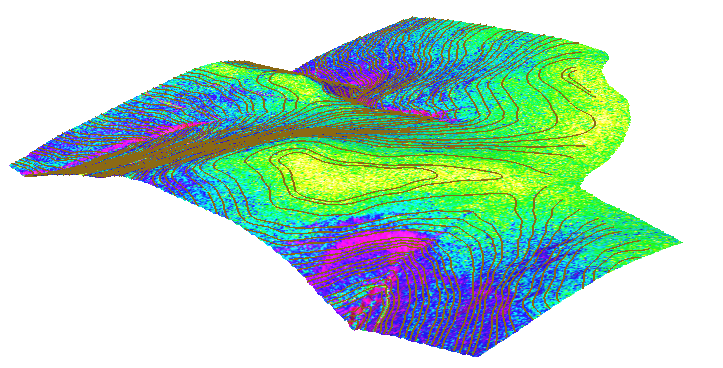

Modeling topography
===================

Computing slope and aspect
--------------------------

Topographic slope and aspect map can be create by
:grasscmd:`r.slope.aspect`.

   Topolographic slope map vizualized in 3D with clipped contours.

Such map can be classified using :grasscmd:`r.recode` into
class. Example:

::
   
   0:2:1
   2:5:2
   5:8:3
   8:15:4
   15:30:5
   30:*:6
   
.. note:: Categories can be labeled by :grasscmd:`r.category`, result
          is shown on the figure bellow.

          ::

             1:0-2 deg
             2:2-5
             3:5-8
             4:8-15
             5:15-30
             6:30-*

          .. figure:: images/slope-reclass.png

             Reclassified slope map with legend.
          
Curvatures
----------

Concavity/convexity of terrain can be explored with curvatures
computed by :grasscmd:`r.param.scale`. Example:

.. code-block:: bash

   # profile curvature
   r.param.scale input=dem37 output=profc37 method=profc size=11

   # tangential curvature
   r.param.scale input=dem37 output=crosc37 method=tangc size=11
                
Landform identification
-----------------------

.. todo:: r.geomorphon

Solar radiation and shades
--------------------------

Visibility analysis
-------------------

Cost surface and least cost path
--------------------------------
