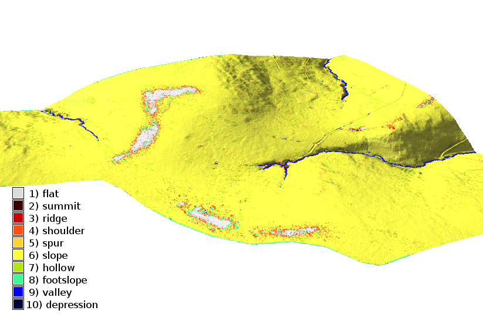
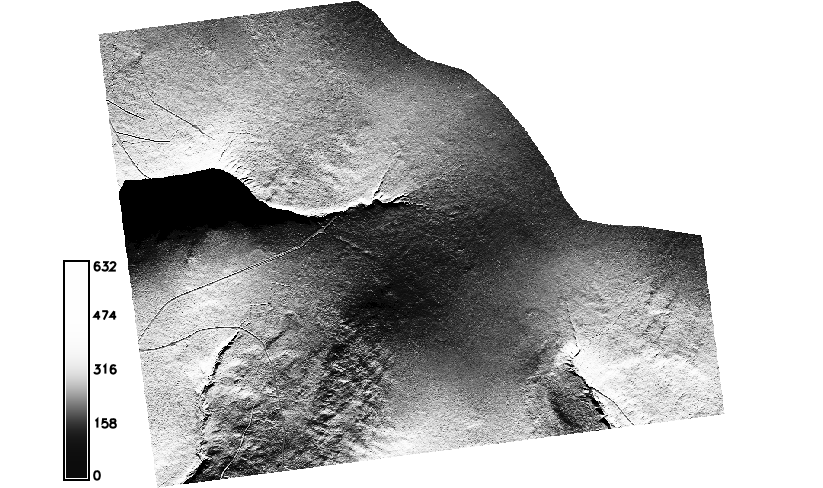
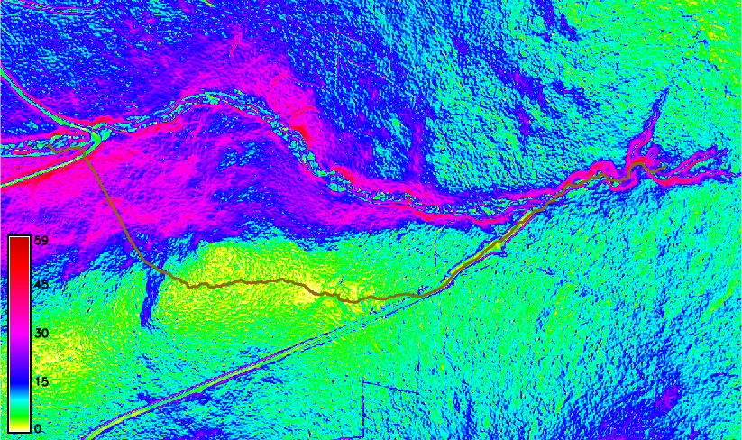

Modeling topography
===================

Computing slope and aspect
--------------------------

Topographic slope and aspect map can be create by
:grasscmd:`r.slope.aspect`.

.. figure:: images/slope-contours-3d.png

   Topolographic slope map vizualized in 3D with clipped contours.

Such map can be classified using :grasscmd:`r.recode` into
class. Example:

::
   
   0:2:1
   2:5:2
   5:8:3
   8:15:4
   15:30:5
   30:*:6
   
.. note:: Categories can be labeled by :grasscmd:`r.category`, result
          is shown on the figure bellow.

          ::

             1:0-2 deg
             2:2-5
             3:5-8
             4:8-15
             5:15-30
             6:30-*

          .. figure:: images/slope-reclass.png

             Reclassified slope map with legend.
          
Curvatures
----------

Concavity/convexity of terrain can be explored with curvatures
computed by :grasscmd:`r.param.scale`. Example:

.. code-block:: bash

   # profile curvature
   r.param.scale input=dem37 output=profc37 method=profc size=11

   # tangential curvature
   r.param.scale input=dem37 output=crosc37 method=tangc size=11
                
Landform identification
-----------------------

Landforms (ridge, valley, ...) can be obtained from curvatures
computed by :grasscmd:`r.param.scale` (:option:`method=feature`). The
modern method based multiscale line-of-sight approach is implemented
by *r.geomorphon* addon.

.. note:: Addons are not part of GRASS distribution and can be
          installed from menu :menuselection:`Settings --> Addons
          extensions --> Install extension from addons` or by
          :grasscmd:`g.extension` command.

Example:

.. code-block:: bash

   r.geomorphon elevation=dem37 forms=landforms37 search=16 skip=6
                    

   Landsform vizualization in 3D.
          
Solar radiation and shades
--------------------------

Based on slope and aspect maps can be computed solar irradiation
(daily radiation sum in Wh/m2.day) for a given day using
:grasscmd:`r.sun`:

.. code-block:: bash

   # day=1 -> 1.1.
   r.sun elevation=dem37 slope=slope37 aspect=aspect37 beam_rad=beam37 step=1 day=1
   r.colors -e map=beam37 color=grey

.. noteadvanced:: Computation can be very slow. Check for
                  parallelization efforts.
             
Than we can also compute solar irradiance (W/m2) for a given day and
hour (in local solar time) and extract the shades cast by topography:

.. code-block:: bash

   r.sun elevation=dem37 slope=slope37 aspect=aspect37 beam_rad=beam37_8 day=1 time=12
   r.colors -e map=beam37_12 color=grey

            
   Solar irradiance (W/m2) 1.1. 12 a.m.

Visibility analysis
-------------------

Visibility analysis can be perform in GRASS by :grasscmd:`r.viewshed`,
see example on the figure below.

.. figure:: images/viewshed.png
   :class: large
        
   Visibility analysis perform in GRASS GUI.

Cost surface and least cost path
--------------------------------

In this example we perform least cost path analysis with slope as
cost. Example:

.. code-block:: bash

   r.cost -k input=slope37 output=cost37 outdir=outdir37 start_coordinates=533072,5626854
   r.colors map=cost37 color=gyr
   r.drain -d input=cost37 output=drain37 direction=outdir37 drain=drain37 start_coordinates=532046,5626889

   Least cost path example.
