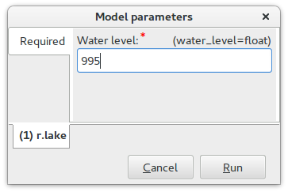

Graphical Modeler
=================

Graphic Modeler (:grasscmd:`g.gui.gmodeler`) allows the user to
create, edit, and manage complex models using easy-to-use
interface. Using Graphical Modeler, that chain of processes (ie. GRASS
modules) can be wrapped into one process (ie. model). So it's easier
to execute the model later with slightly different inputs or
parameters.

Flooding Model Example
----------------------

In our example will be created a model to simulate flooding using
:grasscmd:`r.lake` (see :doc:`Lesson 2 <../lesson2/hydrology>`). The
model will also print flooded area in hectares (:grasscmd:`r.report`)
and output new vector map containing flooded roads
(:grasscmd:`v.overlay`). This step requires to create vector map of
flooded area using :grasscmd:`r.recode` and :grasscmd:`r.to.vect`. The
length of flooded roads can be printed using :grasscmd:`v.to.db`.

Version 1
^^^^^^^^^

   First version of the flooding model.

   Example of output (water level: 990).

Model to download: `lake1.gxm <../_static/models/lake1.gxm>`_

Version 2
^^^^^^^^^

The model uses hardcoded values. In the second version we would like
to parametrize :option:`water_level` option.

   Modules options can be parametrized directly in GUI dialogs.

The modified model will ask user before launching for parametrized
options, in our case for :option:`water_level`, see figure below.

        
   Dialog for parametrized options.

For example increasing water level from 990 to 995 leads to flooded
area 1.43 ha and road length 169 m.

Model to download: `lake2.gxm <../_static/models/lake2.gxm>`_

Version 3
^^^^^^^^^

The model overwrites output data. We will modify the model to create
output raster lake map and clipped roads map for each value
separately. Eg. for water level 990 we will create modified model
*lake_990* and *roads_lake_990*, for level 995 *lake_995* and
*roads_lake_995*. This modification will be implemented in the modeler
using variables. Firstly we disable parametrization of
:option:`water_level` and then we will add new variable
``water_level``, see figure below.

   Adding new variable to the model.

Afterwards we must modify all modules which should use this
variable. In our case:

* :grasscmd:`r.lake`: :option:`water_level`, :option:`lake`
* :grasscmd:`r.mapcalc`: :option:`expression`
* :grasscmd:`r.to.vect`: :option:`input`
* :grasscmd:`v.overlay`: :option:`output`
* :grasscmd:`v.to.db`: :option:`map`

   Modification of :option:`lake` (:grasscmd:`r.lake`).

   Modification of :option:`expression` (:grasscmd:`r.mapcalc`).

Model to download: `lake3.gxm <../_static/models/lake3.gxm>`_

   Comparision of water levels 990 and 995 (:grasscmd:`g.gui.mapswipe`).
