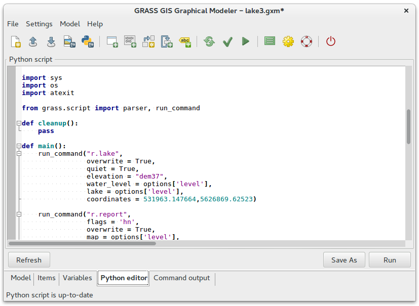
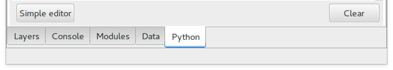
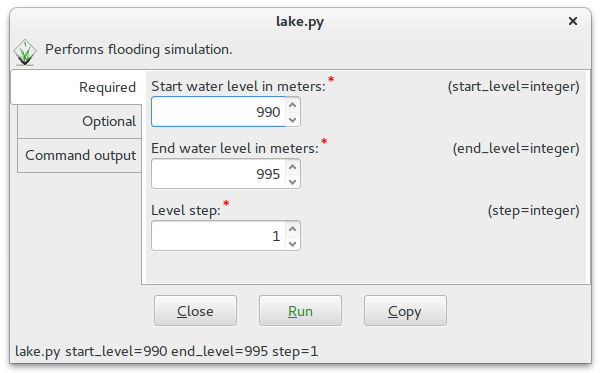

.. |pythoneditor| image:: ../_static/icons/grass/python.png
   :width: 1.5em
.. |script| image:: ../_static/icons/grass/script-load.png
   :width: 1.5em               
                   
Python scripting for GRASS
==========================

Example: Flooding simulation
----------------------------

Instead of creating our first Python script for GRASS from scratch we
will re-use model created in the :doc:`previous section <modeler>`. The
Graphic Modeler allows on-the-fly conversion to simple Python script
(tab *Python editor*).

   Model as Python script.

We save this script to a new file by clicking on *Save as*
button. Python scripts can be launched afterwards from menu
:menuselection:`File --> Launch script` or from the toolbar |script|.

We open this file in GRASS Python editor or in your favourite
editor. GRASS Python editor can be launched from Layer Manager (tab
*Python*, button *Simple editor*), or from the main toolbar
|pythoneditor|.

   Launching GRASS Python editor from Layer Manager.

Our goal is to modify the script to be capable performing flooding
simulation multiple times based on *start* and *end* water level and
*step* value.

One of the advantages is that the resultant script behaves as normal
GRASS module. If user doesn't enter all required parameters GRASS
generates GUI dialog similarly to other GRASS commands.

   Generated GUI dialog of our Python lake script.

Resultant script to download: `lake.py <../_static/scripts/lake.py>`_

.. literalinclude:: ../_static/scripts/lake.py
   :language: python

Real stuff: DEM from Lidar data
----------------------------------------

Script to download: `isprs.py
<../_static/scripts/isprs.py>`_

.. tip:: The script could be easily parallelized by
   ``ParallelModuleQueue`` using :grasscmd2:`pyGRASS
   <libpython/pygrass.modules.interface.html>`.

.. literalinclude:: ../_static/scripts/isprs.py
   :language: python

