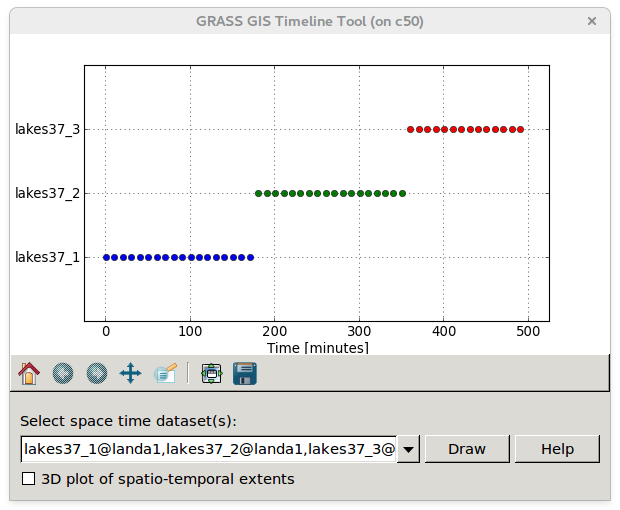
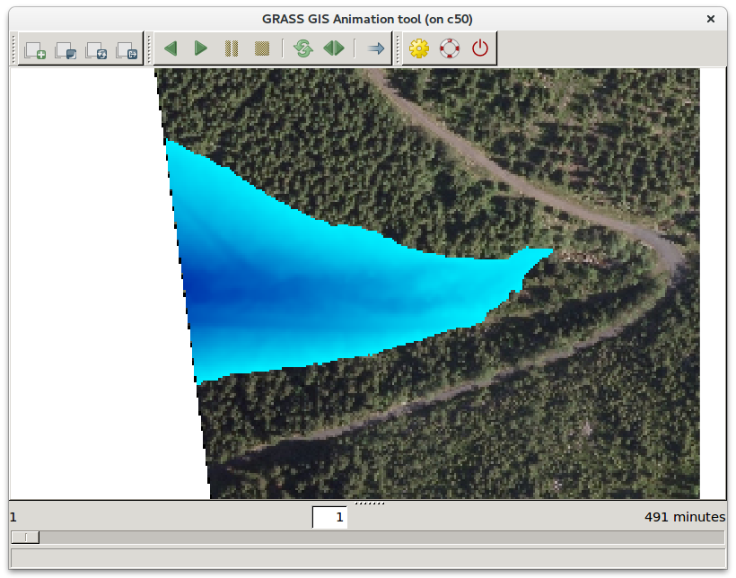

Time-space series based flooding simulation
===========================================

In this section we extend flooding simulation effort performed by
:doc:`r.lake <../lesson2/hydrology>` and later automated by
:doc:`graphical modeler <../lesson3/modeler>` and :doc:`python script
<../lesson3/pyscripting>`. Module :grasscmd:`r.lake` itself allows to
generate only one output raster map within one run. This limitation is
surpass by addon *r.lake.series* (you can install it by
:grasscmd:`g.extension`). This module outputs multiple raster maps
registered in time-space dataset.

.. code-block:: bash

   r.lake.series elevation=dem37 out=lakes37 start_water_level=990 end_water_level=995 \
   water_level_step=0.1 coordinates=531963.147664,5626869.62523 \
   time_step=10 nproc=3

In the example above we create time-space series between water levels
990 and 995 with step 0.1 m. Time step is 10min. To increase
computation speed we use three cores. The result is stored in raster
time-space dataset named *lakes37*.

Basic information about output dataset can be obtained by
:grasscmd:`t.info`.

.. code-block:: bash

   t.info input=lakes37

   ...
   +-------------------- Relative time -----------------------------------------+
   | Start time:................. 1
   | End time:................... 491
   | Relative time unit:......... minutes
   | Granularity:................ 10
   | Temporal type of maps:...... point
   ...
   +-------------------- Metadata information ----------------------------------+
   | Minimum value min:.......... 6.1e-05
   | Minimum value max:.......... 0.004822
   | Maximum value min:.......... 20.624878
   | Maximum value max:.......... 25.524902
   | Number of registered maps:.. 50
   ...

Time topology information can be obtained by :grasscmd:`t.topology`.

.. code-block:: bash

   t.topology input=lakes37

   ...
   +-------------------- Temporal topology -------------------------------------+
   | Temporal topology is: ...... valid
   | Number of points: .......... 50
   | Number of gaps: ............ 49
   | Granularity: ............... 10
   ...

Space-time Data Querying
------------------------

By :grasscmd:`t.list.rast` can be printed raster maps within given
time period. In example below will be printed raster maps generated
with first hour of flooding simulation.

.. code-block:: bash

   t.rast.list input=lakes37 order=start_time where="start_time < 60"

   
   name|mapset|start_time|end_time
   lakes37_990.0|landa|1|None
   lakes37_990.1|landa|11|None
   lakes37_990.2|landa|21|None
   lakes37_990.3|landa|31|None
   lakes37_990.4|landa|41|None
   lakes37_990.5|landa|51|None

Univariate statistic can be calculated by :grasscmd:`t.rast.univar`.

.. code-block:: bash

   t.rast.univar input=lakes37 where="start_time < 60"

   id|start|end|mean|min|max|...
   lakes37_990.0@landa|1|None|7.00716177683415|0.00018310546875|20.6248779296875|...
   lakes37_990.1@landa|11|None|7.03939263446713|0.0001220703125|20.724853515625|...
   lakes37_990.2@landa|21|None|7.06764535033695|0.000244140625|20.8248901367188|...
   lakes37_990.3@landa|31|None|7.09986937087965|0.00048828125|20.9248657226562|...
   lakes37_990.4@landa|41|None|7.13686648936191|0.0018310546875|21.02490234375|...
   lakes37_990.5@landa|51|None|7.17042749303603|0.00030517578125|21.1248779296875|...

Data aggregation can be performed by :grasscmd:`t.rast.aggregate`. In
example below will be data aggregated by 1 hour.

.. code-block:: bash

   t.rast.aggregate input=lakes37 output=lakes37_h basename=ag granularity=60 nproc=3

The command generated a new space time dataset which can be used for
subsequent analysis like univariate statistics:

.. code-block:: bash

   t.rast.univar lakes37_h
   id|start|end|mean|min|max|...
   ag_00001@landa|1|61|6.92733335433335|0.00030517578125|20.8748779296875|...
   ag_00002@landa|61|121|7.11830269624711|0.0006103515625|21.4748738606771|...
   ag_00003@landa|121|181|7.27995970957823|0.00128173828125|22.0748799641927|...
   ag_00004@landa|181|241|7.47419607029642|0.0010986328125|22.6748758951823|...
   ag_00005@landa|241|301|7.69588708932779|0.000244140625|23.2748819986979|...
   ag_00006@landa|301|361|7.92157095217006|0.00115966796875|23.8748779296875|...
   ag_00007@landa|361|421|8.13277508575545|0.000244140625|24.4748738606771|...
   ag_00008@landa|421|481|8.37088971207057|0.00482177734375|25.0748799641927|...
   ag_00009@landa|481|541|8.64080391021424|0.00030517578125|25.4748840332031|...

Space-time Data Extracting
--------------------------

Raster spatial-temporal data can be extract into new datasets using
:grasscmd:`t.rast.extract`. In the example below will be created three
new datasets for first, second and third three hours.

.. code-block:: bash

   t.rast.extract input=lakes37 where="start_time > 0 and start_time < 181" output=lakes37_1
   t.rast.extract input=lakes37 where="start_time > 180 and start_time < 361" output=lakes37_2
   t.rast.extract input=lakes37 where="start_time > 360 and start_time < 541" output=lakes37_3         

Aggregation can be done by :grasscmd:`t.rast.series`:

.. code-block:: bash
                
   t.rast.series input=lakes37_1 output=lakes37_1_avg method=average

Let's compute univariate statistics by :grasscmd:`r.univar`:

.. code-block:: bash

   r.univar map=lakes37_1_avg

   minimum: 0.00128174
   maximum: 21.4749
   range: 21.4736
   mean: 6.74251
   ...
                
Space-time Data Visualization
-----------------------------

Time series can be visualized by specialized tool
:grasscmd:`g.gui.timeline`. Example:

.. code-block:: bash
                
   g.gui.timeline inputs=lakes37_1,lakes37_2,lakes37_3

   Time visualization of aggregated datasets (first, second, third
   three hours).

Other interesting tool is :grasscmd:`g.gui.animation` which allows us
creating animations. Example:

.. code-block:: bash

   g.gui.animation strds=lakes37

   GRASS tools for creating animations.

.. figure:: images/lakes37.gif

   Example of resultant flooding animation.
