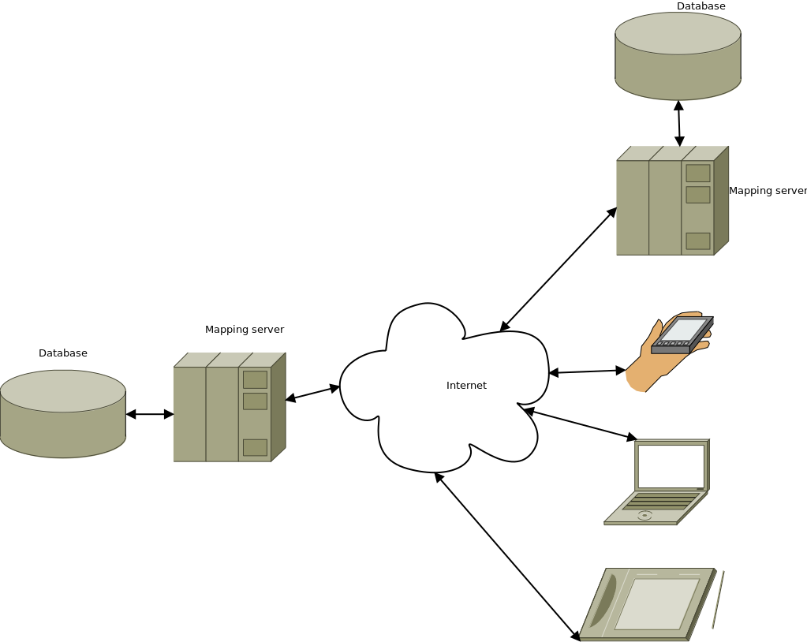

***************************************************
Publication of spatial data using open source tools
***************************************************

.. warning:: In progress...
             
Motivation for publishing spatial data
======================================

* share the data with colleagues, bots
* visualise the data (make nice maps)
* reuse the data
* share BIG data
* add value to data (build map applications)

Components
==========

* Server
* Client

---

* API

    Components needed for spatial data publication infrastructure

    Database, map server, client applications. As "client" - another server can
    be used too.

.. toctree::
   :maxdepth: 3

   ows
