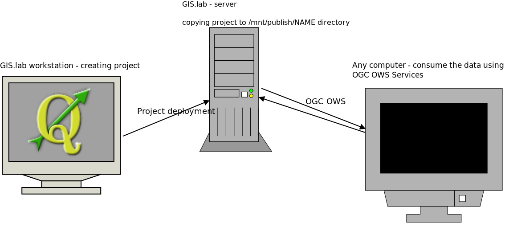

OGC Web Mapping Service
-----------------------

http://opengeospatial.org/standards/wms

Publish map images from data stored on server to the client.

Parameters for the map:

* Image size
* Required layers
* Area extent
* Image format
* Coordinate reference system
* (Layer style)

.. note:: **How does the server and the client communicate**

    Client sends the request encoded in URL to some known server address.
    Example of WMS endpoint::

        http://my.maps-domain.org/wms

    The parameters for the request are stored at the end of the url behind
    starting `?` sign. Each parameter and it's value are separated with `&` sign
    ::

        http://my.maps-domain.org/wms?parameter1=value1&parameter2=value2&...

    The response from the server is either data itself (like PNG or JPEG image)
    or XML-encoded document

WMS Server should be able to handle 3 types of requests:

* GetCapabilities - retrieves server metadata (encoded as XML document)
* GetMap - retrieves PNG or JPEG image
* GetFeatureInfo - allows the client ask for attribute data identified by "mouse
  click" - single point

QGIS project deployment
-----------------------

#. Open `Project properties` dialog and go to `OWS Server` tab

   .. figure:: images/09_ows.png

#. Click `Service capabilities` checkbox and fill needed items

   .. figure:: images/10_publishing.png

        Fill short name, title, organisation, ... 

        WMS Capabilities: click `Use Current Canvas Extent`

        Add supported CRSs

#. `Select all` vector layers for OGC WFS and raster layers for OGC WCS services

    .. figure:: images/11_publishing.png

        Enable WFS and WCS layers, you can limit image size for WMS too

#. `Launch` test configuration

    .. figure:: images/12_publishing.png

        Launch test configuration

#. Save the project as file *next to the `publication-data` directory*

#. Copy `publication-data` along with the QGIS project file to
   `/mnt/publish/YOUR_NAME/` directory

    .. figure:: images/16_copy.png

#. Let's open our created QGIS project with raster and vector data!

.. Parameter MAP, otherwise standard WMS request
    http://localhost/cgi-bin/qgis_mapserv.fcgi?MAP=/home/jachym/Data/isprs/ISPRS%20Summer%20School%20workshop.qgs&SERVICE=WMS&VERSION=1.3.0&REQUEST=GetCapabilities

#. In our case, the OGC OWS server is living in GIS.Lab server instance

    http://gislab:91/cgi-bin/qgis_mapserv.fcgi

#. We have to point the `qgis_mapserver.fcgi` program to our project - we have to
    add `map` parameter to the url 

    `map=cepicky/ISPRS_summerschool_ospublication.qgs`
    
#. Now we can ask for metadata from the server::

            service=wms
            request=getcapabilities
     

   Each request parameter is to be separated in form::

            key=value

   Parameters are separated using `&` sign

   All parameters are separated from the file name using `?` sign::

            http://gislab:91/cgi-bin/qgis_mapserv.fcgi?
            map=cepicky/ISPRS_summerschool_ospublication.qgs&
            service=wms&
            request=getcapabilities

   Putting it to one line

    http://gislab:91/cgi-bin/qgis_mapserv.fcgi?map=cepicky/ISPRS_summerschool_ospublication.qgs&service=wms&request=getcapabilities

#. Now we can get the map

   http://gislab:91/cgi-bin/qgis_mapserv.fcgi?map=cepicky/ISPRS_summerschool_ospublication.qgs&service=WMS&request=getmap&width=800&height=600&crs=epsg:32633&layers=Hydrology&format=image/png&bbox=527542,5.44521e+06,539858,5.45313e+06 

   .. figure:: images/17_getmap.png

What have we done?
------------------

    Deploying of the project

Load Published WMS service to QGIS
----------------------------------

.. note:: It's is wort to start new fresh empty QGIS project for this step for
        not getting confused with the layers you may have in the layerswitcher

#. In QGIS, you can now add new WMS server

    .. figure:: images/13_wms_client.png

     Add new `WMS layer - New server` with URL http://gislab:91/cgi-bin/qgis_mapserv.fcgi?map=cepicky/ISPRS_summerschool_ospublication.qgs

     And leave the rest

#. `Connect` to the server and select some layer, choose `PNG` image format,
   create name

    .. figure:: images/14_wms_addlayer.png

#. You now may have new raster layer, published from our WMS server
    
   .. figure:: images/deploying.png

